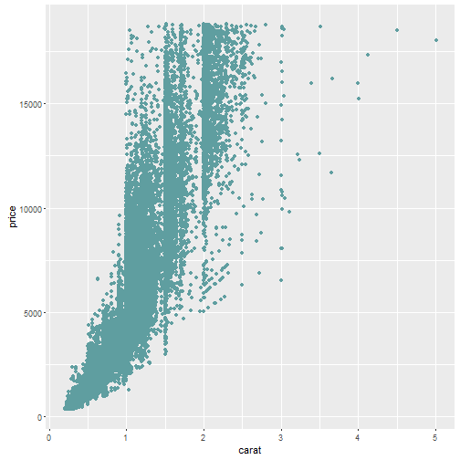
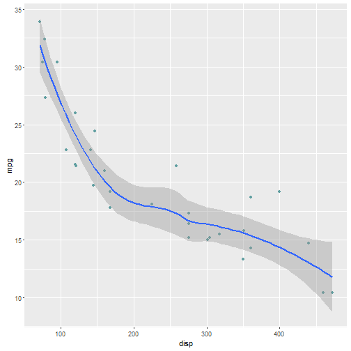

## HELLO!!!

> 1. Welcome to my short presentation
> 2. I will go through the slides at a slow pace
> 3. Pleae feel free to interrupt me for questions!

--- .class #id 

## This is me in two points

> 1. Tomorrow will be my first birthday
> 2. I already know how to read, solve basic Math problems, and write some computer codes

---
## sharing with you one of my secrets

---

## Another secret - maybe the last one

